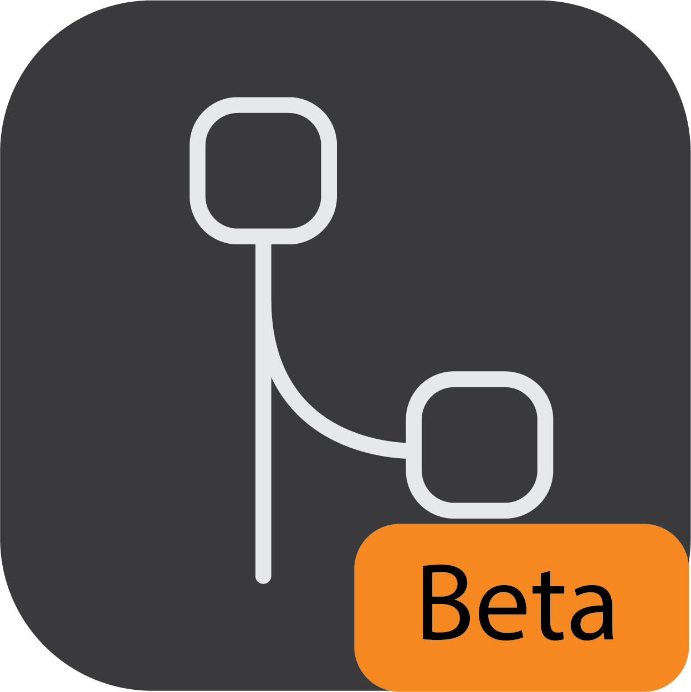
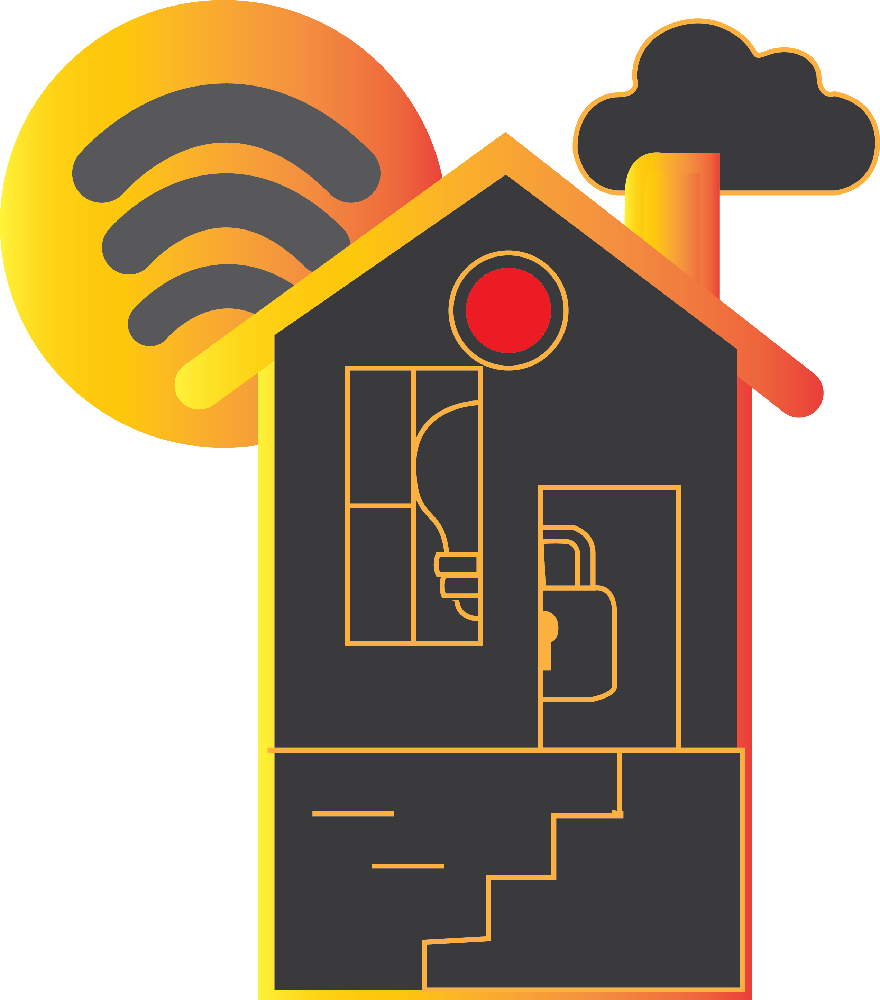
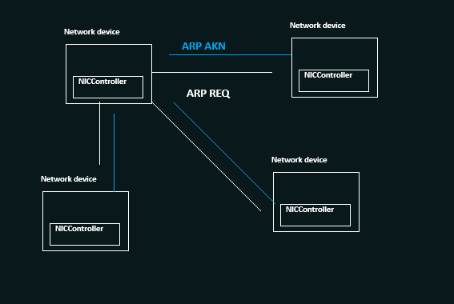
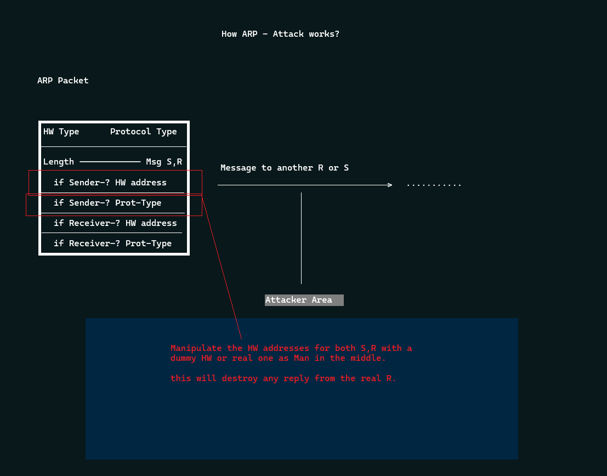
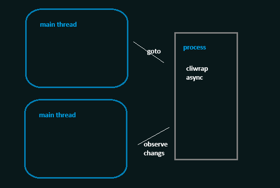
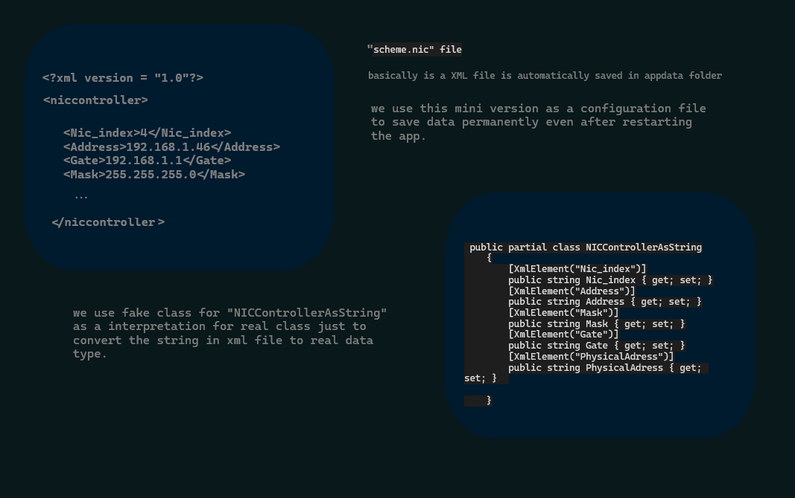

# DarkArmor [inDark Sneaky]

 New tool to cut packet off on network programmed in MVVM pattern for educational purposes.  
 

 
 

<!-- ABOUT THE PROJECT -->
## About The Project

* Overview💡

 

* NIC cards preferences [still beta]⚙️

 

There are many great apps out there available. however, I didn't find one that really suited my needs UI and performance so I created this enhanced one.

<!-- ROADMAP PROJECT -->
## ROAD MAP 🌴
* Set Environemnt intializer
* Add Data classes to the folowing : 
    * Execute the collector.
    * Send request from (src) to (dest).
    * Collect reply as akn from the collector.
    * Get info from domain ARP message.

* Addon tools 🫰
1) Spoofing

  <!-- PROCESS MECHANISM PROJECT -->
## How Async Process Works ✌️

 

   <!-- PROCESS MECHANISM PROJECT -->
## Mini Database 🍑
